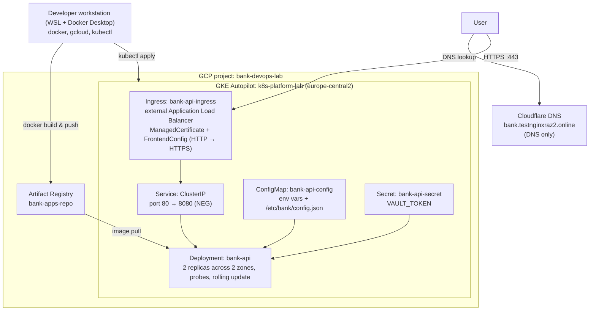

# k8s-platform-lab

Kubernetes platform built step by step on GKE, as a hands-on DevOps learning project.

Current state: containerized Python API running on GKE Autopilot, with health checks,
zero-downtime rolling updates, ConfigMaps and Secrets, and HTTPS through GKE Ingress
with a Google-managed certificate.
Planned: persistent storage and PostgreSQL, then Terraform, CI/CD, Helm, monitoring.

The cluster runs only during work sessions, so the public URL is usually offline.

Progress and lessons learned: [PROGRESS.md](PROGRESS.md)

## Architecture



## Repository structure

```
app/        Python API (Flask + Gunicorn) and Dockerfile
k8s/        Kubernetes manifests
            deployment, service, configmap, secret template,
            ingress, managed certificate, frontend config
PROGRESS.md Work log: what I did, what broke, what I learned
```

## Deploy

Requires an existing GKE cluster, `kubectl` configured for it,
and a domain pointing to the Ingress IP.

```bash
# create your own secret from the template (never commit it)
cp k8s/secret.example.yaml k8s/secret.yaml
# edit k8s/secret.yaml and fill in the values

kubectl apply -f k8s/configmap.yaml
kubectl apply -f k8s/secret.yaml
kubectl apply -f k8s/deployment.yaml
kubectl apply -f k8s/service.yaml
kubectl apply -f k8s/certificate.yaml
kubectl apply -f k8s/frontend-config.yaml
kubectl apply -f k8s/ingress.yaml
```

The Google-managed certificate can take 40–60 minutes to become `Active`:

```bash
kubectl get managedcertificate bank-api-cert
```