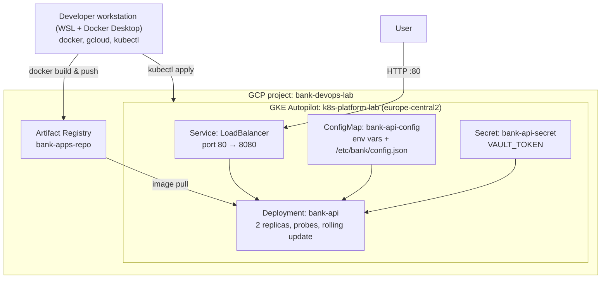

# k8s-platform-lab

Kubernetes platform built step by step on GKE, as a hands-on DevOps learning project.

Current state: containerized Python API running on GKE Autopilot, with health checks,
zero-downtime rolling updates, ConfigMaps and Secrets.
Planned: Terraform, CI/CD, Helm, Ingress with TLS, monitoring.

Progress and lessons learned: [PROGRESS.md](PROGRESS.md)

## Architecture

